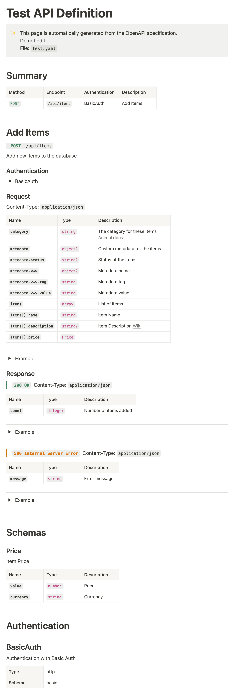
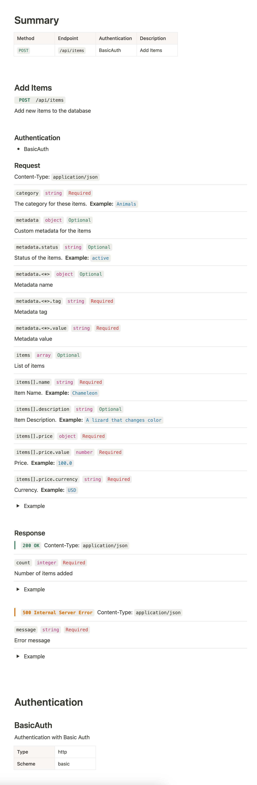

Experimental utility to convert OpenAPI definitions to Notion Pages via the Notion API.   
WARNING: Code is messy, OpenAPI support is limited, just a proof of concept.  

# Usage
- Create an internal Notion integration and get the secret token
- The Target Notion page needs to be shared with the integration
- The Target page needs to be contained in a notion Wiki (to be able to add properties)
- Create a property in the Wiki named exactly `OpenAPI-Generated`
- The OpenAPI definitions need to have a unique title which will be used as the page title
- Run the program locally or as a GitHub action

# Options
### OpenAPI extensions:
- `x-notion-flatten` : Flatten the object structure instead of linking to schemas (default false).
- `x-notion-header`: Hide or show the page header (default true).
### Config File
The config file is a YAML file with the following structure:
```yaml
generateCollection: '/path/to/collection.yaml'
template: 2
pages:
  - notionPageId: aaaaaaaaaaaaaaa
    apiFolder: path/to/docs
  - notionPageId: bbbbbbbbbbbbbbb
    apiFolder: path/to/other
```
- `pages`: list is a list of Target Notion pages and the path to the folder containing the OpenAPI definitions.
- `generateCollection`: is an optional path to a collection file that will be generated with all the input files.
- `template`: is an optional integer to select the template to use. Default is 2. (1 or 2)

# GitHub Action
It is necessary to use depth 0 to correctly evaluate files changed time
```yaml
jobs:
  openapi-to-notion:
    runs-on: ubuntu-latest
    steps:
      - name: Checkout code
        uses: actions/checkout@v4
        with:
          fetch-depth: 0
      - name: Build API docs
        uses: PaoloConte/openapi-to-notion@v1.6.3
        with:
          notion-token: ${{ secrets.NOTION_TOKEN }}
          config: |            
            pages:
              - notionPageId: aaaaaaaaaaaaaaa
                apiFolder: path/to/docs
              - notionPageId: bbbbbbbbbbbbbbb
                apiFolder: path/to/other  

```
# Run Locally

### Requirements
- Java 11+

### Build
```bash
./gradlew shadowJar
```

### Environment Variables
- `NOTION_TOKEN` : The Notion integration API token

### Run
```bash
export NOTION_TOKEN=secret_ababababababababababba
java -jar build/libs/app.jar --config-file config.yaml 
```

# Test Screenshot
### Template 2 (default)

### Template 1
